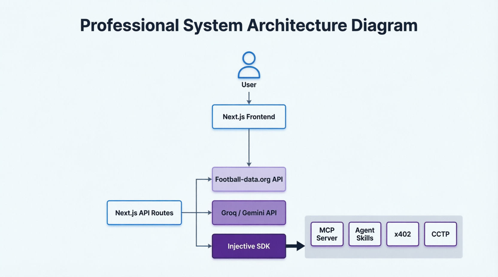

# CupPulse AI

## Real-time World Cup Insights, AI Predictions & Fan Rewards Powered by Injective


**Live Demo:** [https://cup-pulse-ai.vercel.app](https://cup-pulse-ai.vercel.app/)  

---

## Description

CupPulse AI is a football intelligence platform built for the Injective Global Cup Hackathon. It provides real-time World Cup match insights, AI-powered match predictions, fan engagement rewards, user profiles, leaderboard tracking, premium access concepts, and demonstrates Injective ecosystem integrations in a simple and user-friendly application.

---

## Problem

World Cup fans often need multiple platforms to:

- Track match schedules and scores
- Analyze team performance
- Get match predictions
- Participate in fan engagement activities
- Receive rewards for participation
- Manage their account and prediction history

There is no single platform that combines AI insights, fan rewards, profile analytics, and blockchain-powered experiences in one place.

---

## Solution

CupPulse AI provides:

- Real-time World Cup match dashboard
- AI-powered match predictions
- Fan points and rewards system
- Daily check-in streaks
- Leaderboard tracking
- User profile page with stats and account details
- Simulated Injective reward distribution
- Simple and modern user experience

---

## Features

### World Cup Dashboard

- Live matches
- Upcoming matches
- Finished matches
- Expandable match cards
- Team overview and AI insight preview
- Demo match showcase flow

### AI Match Predictions

Ask questions such as:

```text
Who is likely to win Argentina vs Brazil?
```
Receive:

- Predicted winner
- Confidence score
- AI reasoning
- Win probability breakdown
- Form comparison
- Elo-based football context

### Fan Rewards
Users can:

- Earn fan points
- Track reward eligibility
- Claim daily check-in rewards
- Build streaks
- Redeem reward progress
- View reward history

### Leaderboard
Users can:

- See ranked fan standings
- Compare points with others
- Track progress over time

### Profile Page
Users can view:

- Profile picture
- Username
- Display name
- Email
- Join date
- Total points
- Current rank
- Current streak
- Predictions made
- Prediction accuracy
- Best prediction
- Premium status
- Wallet information
- Account security settings

### Injective Integration
CupPulse AI demonstrates how Injective technologies can be used together in a football fan engagement prototype.

- **MCP Server**: provides a structured football data layer for AI prediction workflows and match context.
- **Agent Skills**: power prediction reasoning, confidence scoring, and matchup analysis.
- **x402**: models premium analytics access and paid insight tiers for advanced prediction signals.
- **USDC CCTP**: simulates cross-chain fan reward distribution and tokenized reward flows on Injective testnet concepts.
This project integrates Injective as a demo/testnet architecture rather than a full mainnet deployment. Users interact with the app by browsing matches, submitting predictions, tracking points, and claiming rewards through the UI, while Injective concepts are shown as the backend reward and premium access model.

---

## Tech Stack

### Frontend

- Next.js 16.2.10
- React 19
- TypeScript
- TailwindCSS

### Authentication

- Firebase Authentication
- Google Sign-In
- Email/Password Sign-In

### Database

- Firestore

### AI

- Groq API
- Llama 3.3 70B

### Football Data

- Football-Data.org API

### Blockchain / Web3

- Injective SDK (Demo Integration)
- MCP Server
- Agent Skills
- x402
- CCTP

### Deployment

- Vercel

---

## Injective Technology Mapping

| Injective Technology | Usage |
|----------------------|---------------------------------------------------------------------------------------------------------|
| MCP Server | AI access to football match data |
| Agent Skills | Match Prediction Agent |
| x402 | Premium AI insights concept |
| CCTP | Cross-chain reward distribution simulation |

---

## Project Structure

```text
cup-pulse-ai/

├── app/
│   ├── api/
│   │   ├── checkin/
│   │   ├── demo-match/
│   │   ├── login/
│   │   ├── logout/
│   │   ├── matches/
│   │   ├── mcp/
│   │   ├── me/
│   │   ├── predict/
│   │   ├── predictions/
│   │   │   └── submit/
│   │   ├── premium/
│   │   ├── profile/
│   │   ├── register/
│   │   ├── rewards/
│   │   └── verify-payment/
│   ├── dashboard/
│   ├── injective/
│   ├── leaderboard/
│   ├── login/
│   ├── logout/
│   ├── predictions/
│   ├── premium/
│   ├── privacy/
│   ├── profile/
│   ├── register/
│   ├── rewards/
│   ├── simulator/
│   └── terms/
├── components/
├── docs/
│   └── screenshots/
├── lib/
├── mcp/
├── public/
├── scripts/
├── tests/
├── eslint.config.mjs
├── firebase.tsx
├── next-env.d.ts
├── next.config.ts
├── package.json
├── postcss.config.mjs
├── README.md
└── tsconfig.json
```

---

## Architecture

```text
User
 │
 ▼
Next.js Frontend
 │
 ▼
API Routes
 │
 ├── Football Data API
 ├── Groq AI
 ├── Firestore
 └── Injective Integration
      │
      ├── MCP
      ├── Agent Skills
      ├── x402
      └── CCTP
```

---

## Demo Flow

### 1. Open Dashboard
View:

- Upcoming matches
- Match schedules
- Team details
- Match insights
- Demo match showcase

### 2. AI Prediction
Ask:

```text
Who is likely to win France vs England?
```
Receive:

- Winner prediction
- Confidence score
- AI analysis
- Win probability breakdown

### 3. Fan Rewards

- View earned points
- Check reward eligibility
- Track daily streaks

### 4. Claim Reward

- Simulate reward distribution
- Update points and reward progress

### 5. Leaderboard

- Compare rankings
- Track top fan accounts
- View point-based standings

### 6. Profile Page
View:

- User details
- Prediction stats
- Streaks
- Premium status
- Wallet information
- Security settings

### 7. Injective Showcase
Explore:

- MCP Server
- Agent Skills
- x402
- CCTP

---

## Screenshots
Add screenshots inside:

```text
docs/screenshots/
```



Suggested screenshots:

- [Home](/public/home.png)
- [Premium](public/Premium.png)
- [Dashboard](public/Dashboard.png)
- [Rewards](public/Rewards.png)
- [Profile](public/profile.png)

---

## Environment Variables
Create:

```text
.env.local
```
Add:

```env
FOOTBALL_API_KEY=your_football_data_api_key
GROQ_API_KEY=your_groq_api_key
FIREBASE_API_KEY=your_firebase_api_key
FIREBASE_AUTH_DOMAIN=your_firebase_auth_domain
FIREBASE_PROJECT_ID=your_firebase_project_id
FIREBASE_STORAGE_BUCKET=your_firebase_storage_bucket
FIREBASE_MESSAGING_SENDER_ID=your_firebase_messaging_sender_id
FIREBASE_APP_ID=your_firebase_app_id
```

---

## Installation

Clone the repository:

```bash
git clone <repository-url>
```
Install dependencies:

```bash
npm install
```
Run development server:

```bash
npm run dev
```
Open:

```text
http://localhost:3000
```

---

## Future Scope

- Live World Cup match updates
- Better prediction accuracy models
- Prediction leaderboard
- Real Injective transactions
- Real CCTP integration
- NFT fan achievements
- Premium AI insights using x402
- Match history and analytics charts
- Wallet-linked fan identity
- Tournament bracket visualisation

---

## Built For

### Injective Global Cup Hackathon
CupPulse AI demonstrates how AI, football analytics, fan engagement, Firebase-backed identity, and Injective ecosystem technologies can create a modern World Cup experience.

---

## Team

Built with ❤️ for the Injective Global Cup Hackathon.
